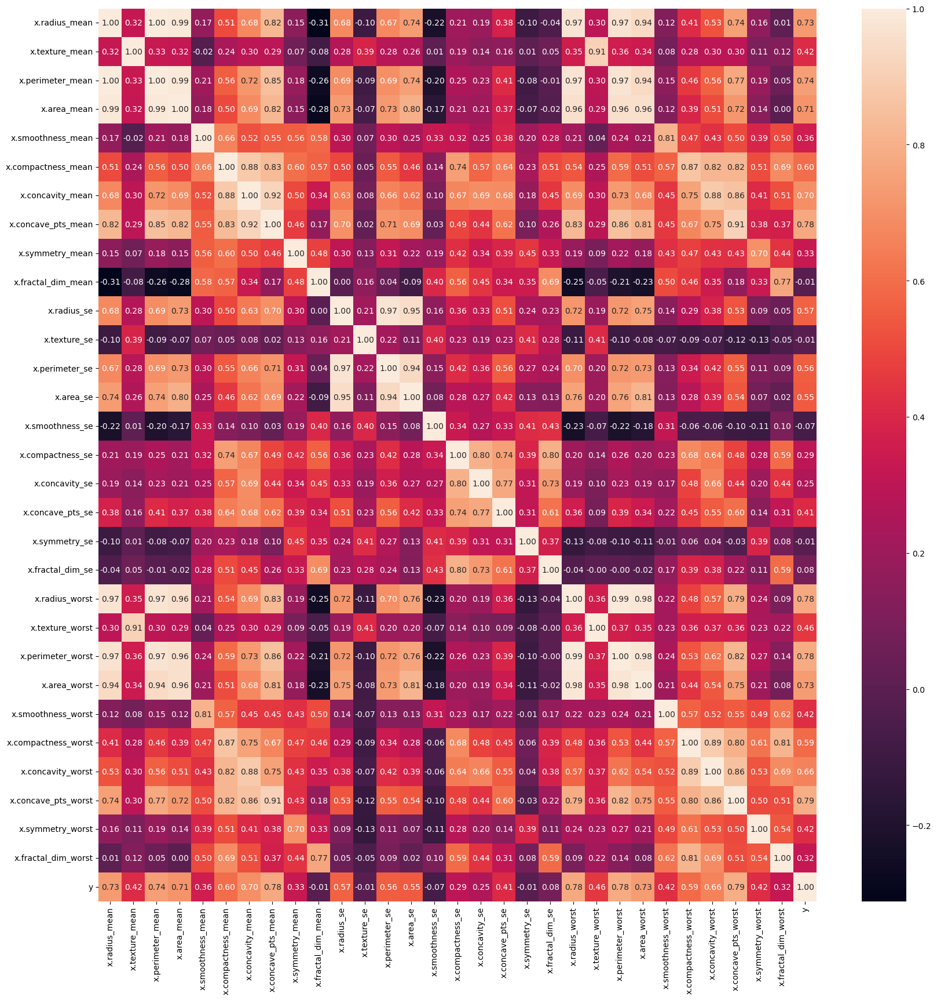
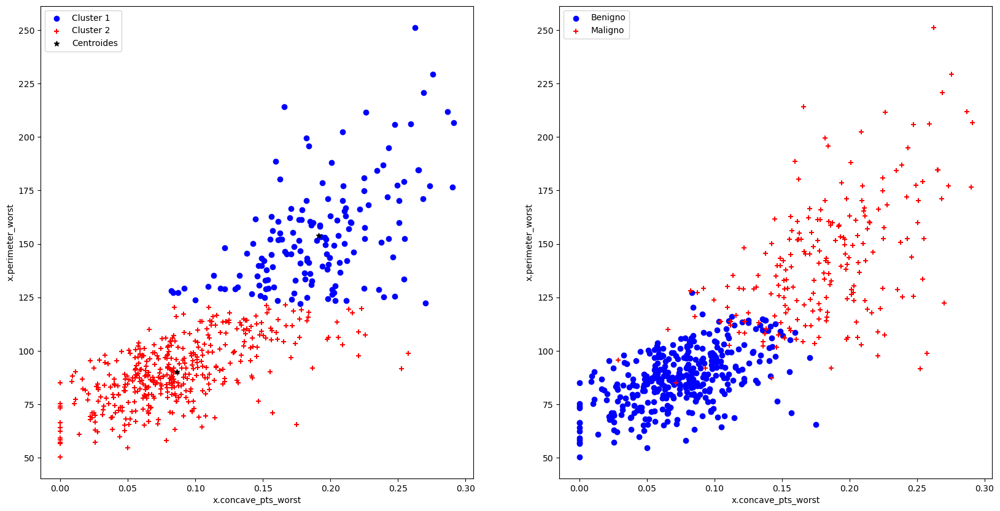
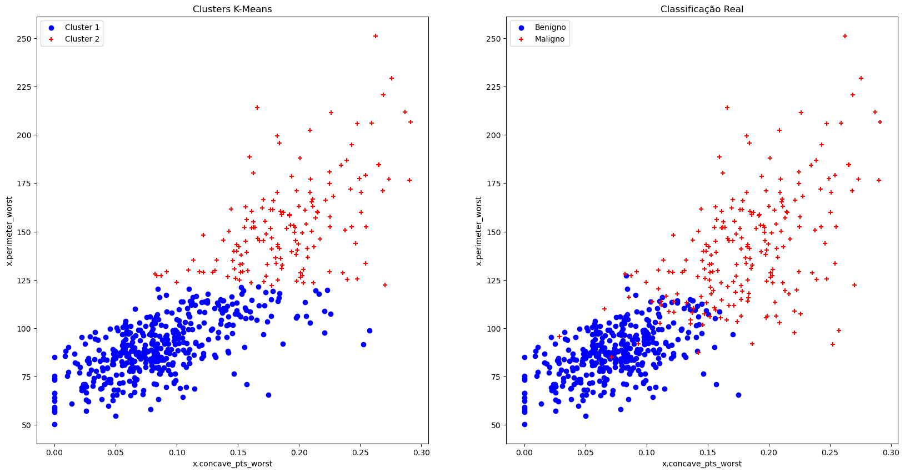
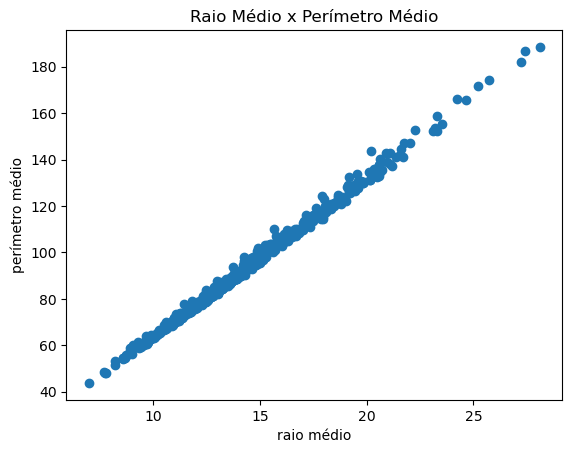
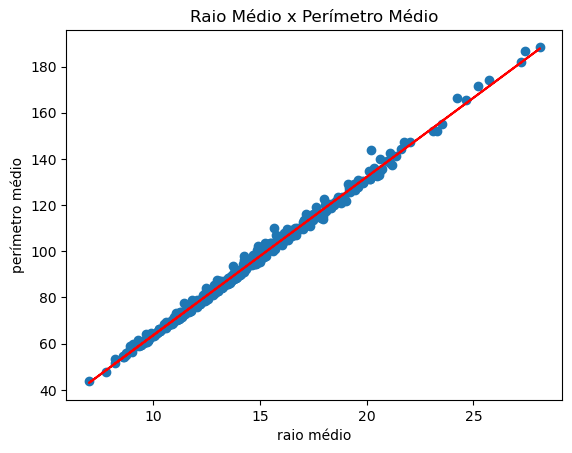

## Desafio 1º Período CIS
| Autor: | Hugo Silva de Vasconcelos |
| --- | --- |
| Data: | 06/07/2023 |
|Dataset: | [Breast Cancer Wisconsin Diagnostic Dataset](https://www.kaggle.com/datasets/utkarshx27/breast-cancer-wisconsin-diagnostic-dataset) |

Dataset: https://www.kaggle.com/datasets/utkarshx27/breast-cancer-wisconsin-diagnostic-dataset?resource=download

Dados sobre câncer de mama, com 569 amostras e 31 atributos, sendo 29 numéricos e 2 categóricos.


```python
import pandas as pd
import matplotlib.pyplot as plt
import seaborn as sns
import sklearn as sk
```


```python
df_kmeans = pd.read_csv('brca.csv', index_col=0)
df_kmeans.head(10)
```


<div>
<style scoped>
    .dataframe tbody tr th:only-of-type {
        vertical-align: middle;
    }

    .dataframe tbody tr th {
        vertical-align: top;
    }

    .dataframe thead th {
        text-align: right;
    }
</style>
<table border="1" class="dataframe">
  <thead>
    <tr style="text-align: right;">
      <th></th>
      <th>x.radius_mean</th>
      <th>x.texture_mean</th>
      <th>x.perimeter_mean</th>
      <th>x.area_mean</th>
      <th>x.smoothness_mean</th>
      <th>x.compactness_mean</th>
      <th>x.concavity_mean</th>
      <th>x.concave_pts_mean</th>
      <th>x.symmetry_mean</th>
      <th>x.fractal_dim_mean</th>
      <th>...</th>
      <th>x.texture_worst</th>
      <th>x.perimeter_worst</th>
      <th>x.area_worst</th>
      <th>x.smoothness_worst</th>
      <th>x.compactness_worst</th>
      <th>x.concavity_worst</th>
      <th>x.concave_pts_worst</th>
      <th>x.symmetry_worst</th>
      <th>x.fractal_dim_worst</th>
      <th>y</th>
    </tr>
  </thead>
  <tbody>
    <tr>
      <th>1</th>
      <td>13.540</td>
      <td>14.36</td>
      <td>87.46</td>
      <td>566.3</td>
      <td>0.09779</td>
      <td>0.08129</td>
      <td>0.06664</td>
      <td>0.047810</td>
      <td>0.1885</td>
      <td>0.05766</td>
      <td>...</td>
      <td>19.26</td>
      <td>99.70</td>
      <td>711.2</td>
      <td>0.14400</td>
      <td>0.17730</td>
      <td>0.23900</td>
      <td>0.12880</td>
      <td>0.2977</td>
      <td>0.07259</td>
      <td>B</td>
    </tr>
    <tr>
      <th>2</th>
      <td>13.080</td>
      <td>15.71</td>
      <td>85.63</td>
      <td>520.0</td>
      <td>0.10750</td>
      <td>0.12700</td>
      <td>0.04568</td>
      <td>0.031100</td>
      <td>0.1967</td>
      <td>0.06811</td>
      <td>...</td>
      <td>20.49</td>
      <td>96.09</td>
      <td>630.5</td>
      <td>0.13120</td>
      <td>0.27760</td>
      <td>0.18900</td>
      <td>0.07283</td>
      <td>0.3184</td>
      <td>0.08183</td>
      <td>B</td>
    </tr>
    <tr>
      <th>3</th>
      <td>9.504</td>
      <td>12.44</td>
      <td>60.34</td>
      <td>273.9</td>
      <td>0.10240</td>
      <td>0.06492</td>
      <td>0.02956</td>
      <td>0.020760</td>
      <td>0.1815</td>
      <td>0.06905</td>
      <td>...</td>
      <td>15.66</td>
      <td>65.13</td>
      <td>314.9</td>
      <td>0.13240</td>
      <td>0.11480</td>
      <td>0.08867</td>
      <td>0.06227</td>
      <td>0.2450</td>
      <td>0.07773</td>
      <td>B</td>
    </tr>
    <tr>
      <th>4</th>
      <td>13.030</td>
      <td>18.42</td>
      <td>82.61</td>
      <td>523.8</td>
      <td>0.08983</td>
      <td>0.03766</td>
      <td>0.02562</td>
      <td>0.029230</td>
      <td>0.1467</td>
      <td>0.05863</td>
      <td>...</td>
      <td>22.81</td>
      <td>84.46</td>
      <td>545.9</td>
      <td>0.09701</td>
      <td>0.04619</td>
      <td>0.04833</td>
      <td>0.05013</td>
      <td>0.1987</td>
      <td>0.06169</td>
      <td>B</td>
    </tr>
    <tr>
      <th>5</th>
      <td>8.196</td>
      <td>16.84</td>
      <td>51.71</td>
      <td>201.9</td>
      <td>0.08600</td>
      <td>0.05943</td>
      <td>0.01588</td>
      <td>0.005917</td>
      <td>0.1769</td>
      <td>0.06503</td>
      <td>...</td>
      <td>21.96</td>
      <td>57.26</td>
      <td>242.2</td>
      <td>0.12970</td>
      <td>0.13570</td>
      <td>0.06880</td>
      <td>0.02564</td>
      <td>0.3105</td>
      <td>0.07409</td>
      <td>B</td>
    </tr>
    <tr>
      <th>6</th>
      <td>12.050</td>
      <td>14.63</td>
      <td>78.04</td>
      <td>449.3</td>
      <td>0.10310</td>
      <td>0.09092</td>
      <td>0.06592</td>
      <td>0.027490</td>
      <td>0.1675</td>
      <td>0.06043</td>
      <td>...</td>
      <td>20.70</td>
      <td>89.88</td>
      <td>582.6</td>
      <td>0.14940</td>
      <td>0.21560</td>
      <td>0.30500</td>
      <td>0.06548</td>
      <td>0.2747</td>
      <td>0.08301</td>
      <td>B</td>
    </tr>
    <tr>
      <th>7</th>
      <td>13.490</td>
      <td>22.30</td>
      <td>86.91</td>
      <td>561.0</td>
      <td>0.08752</td>
      <td>0.07698</td>
      <td>0.04751</td>
      <td>0.033840</td>
      <td>0.1809</td>
      <td>0.05718</td>
      <td>...</td>
      <td>31.82</td>
      <td>99.00</td>
      <td>698.8</td>
      <td>0.11620</td>
      <td>0.17110</td>
      <td>0.22820</td>
      <td>0.12820</td>
      <td>0.2871</td>
      <td>0.06917</td>
      <td>B</td>
    </tr>
    <tr>
      <th>8</th>
      <td>11.760</td>
      <td>21.60</td>
      <td>74.72</td>
      <td>427.9</td>
      <td>0.08637</td>
      <td>0.04966</td>
      <td>0.01657</td>
      <td>0.011150</td>
      <td>0.1495</td>
      <td>0.05888</td>
      <td>...</td>
      <td>25.72</td>
      <td>82.98</td>
      <td>516.5</td>
      <td>0.10850</td>
      <td>0.08615</td>
      <td>0.05523</td>
      <td>0.03715</td>
      <td>0.2433</td>
      <td>0.06563</td>
      <td>B</td>
    </tr>
    <tr>
      <th>9</th>
      <td>13.640</td>
      <td>16.34</td>
      <td>87.21</td>
      <td>571.8</td>
      <td>0.07685</td>
      <td>0.06059</td>
      <td>0.01857</td>
      <td>0.017230</td>
      <td>0.1353</td>
      <td>0.05953</td>
      <td>...</td>
      <td>23.19</td>
      <td>96.08</td>
      <td>656.7</td>
      <td>0.10890</td>
      <td>0.15820</td>
      <td>0.10500</td>
      <td>0.08586</td>
      <td>0.2346</td>
      <td>0.08025</td>
      <td>B</td>
    </tr>
    <tr>
      <th>10</th>
      <td>11.940</td>
      <td>18.24</td>
      <td>75.71</td>
      <td>437.6</td>
      <td>0.08261</td>
      <td>0.04751</td>
      <td>0.01972</td>
      <td>0.013490</td>
      <td>0.1868</td>
      <td>0.06110</td>
      <td>...</td>
      <td>21.33</td>
      <td>83.67</td>
      <td>527.2</td>
      <td>0.11440</td>
      <td>0.08906</td>
      <td>0.09203</td>
      <td>0.06296</td>
      <td>0.2785</td>
      <td>0.07408</td>
      <td>B</td>
    </tr>
  </tbody>
</table>
<p>10 rows × 31 columns</p>
</div>


```python
print(df_kmeans.shape)
```

    (569, 31)


```python
# Transformando a coluna y em 0 e 1 (One Hot Encoding)
df_kmeans['y'] = df_kmeans['y'].map({'B': 0, 'M': 1})
df_kmeans.head(10)
```


<div>
<style scoped>
    .dataframe tbody tr th:only-of-type {
        vertical-align: middle;
    }

    .dataframe tbody tr th {
        vertical-align: top;
    }

    .dataframe thead th {
        text-align: right;
    }
</style>
<table border="1" class="dataframe">
  <thead>
    <tr style="text-align: right;">
      <th></th>
      <th>x.radius_mean</th>
      <th>x.texture_mean</th>
      <th>x.perimeter_mean</th>
      <th>x.area_mean</th>
      <th>x.smoothness_mean</th>
      <th>x.compactness_mean</th>
      <th>x.concavity_mean</th>
      <th>x.concave_pts_mean</th>
      <th>x.symmetry_mean</th>
      <th>x.fractal_dim_mean</th>
      <th>...</th>
      <th>x.texture_worst</th>
      <th>x.perimeter_worst</th>
      <th>x.area_worst</th>
      <th>x.smoothness_worst</th>
      <th>x.compactness_worst</th>
      <th>x.concavity_worst</th>
      <th>x.concave_pts_worst</th>
      <th>x.symmetry_worst</th>
      <th>x.fractal_dim_worst</th>
      <th>y</th>
    </tr>
  </thead>
  <tbody>
    <tr>
      <th>1</th>
      <td>13.540</td>
      <td>14.36</td>
      <td>87.46</td>
      <td>566.3</td>
      <td>0.09779</td>
      <td>0.08129</td>
      <td>0.06664</td>
      <td>0.047810</td>
      <td>0.1885</td>
      <td>0.05766</td>
      <td>...</td>
      <td>19.26</td>
      <td>99.70</td>
      <td>711.2</td>
      <td>0.14400</td>
      <td>0.17730</td>
      <td>0.23900</td>
      <td>0.12880</td>
      <td>0.2977</td>
      <td>0.07259</td>
      <td>0</td>
    </tr>
    <tr>
      <th>2</th>
      <td>13.080</td>
      <td>15.71</td>
      <td>85.63</td>
      <td>520.0</td>
      <td>0.10750</td>
      <td>0.12700</td>
      <td>0.04568</td>
      <td>0.031100</td>
      <td>0.1967</td>
      <td>0.06811</td>
      <td>...</td>
      <td>20.49</td>
      <td>96.09</td>
      <td>630.5</td>
      <td>0.13120</td>
      <td>0.27760</td>
      <td>0.18900</td>
      <td>0.07283</td>
      <td>0.3184</td>
      <td>0.08183</td>
      <td>0</td>
    </tr>
    <tr>
      <th>3</th>
      <td>9.504</td>
      <td>12.44</td>
      <td>60.34</td>
      <td>273.9</td>
      <td>0.10240</td>
      <td>0.06492</td>
      <td>0.02956</td>
      <td>0.020760</td>
      <td>0.1815</td>
      <td>0.06905</td>
      <td>...</td>
      <td>15.66</td>
      <td>65.13</td>
      <td>314.9</td>
      <td>0.13240</td>
      <td>0.11480</td>
      <td>0.08867</td>
      <td>0.06227</td>
      <td>0.2450</td>
      <td>0.07773</td>
      <td>0</td>
    </tr>
    <tr>
      <th>4</th>
      <td>13.030</td>
      <td>18.42</td>
      <td>82.61</td>
      <td>523.8</td>
      <td>0.08983</td>
      <td>0.03766</td>
      <td>0.02562</td>
      <td>0.029230</td>
      <td>0.1467</td>
      <td>0.05863</td>
      <td>...</td>
      <td>22.81</td>
      <td>84.46</td>
      <td>545.9</td>
      <td>0.09701</td>
      <td>0.04619</td>
      <td>0.04833</td>
      <td>0.05013</td>
      <td>0.1987</td>
      <td>0.06169</td>
      <td>0</td>
    </tr>
    <tr>
      <th>5</th>
      <td>8.196</td>
      <td>16.84</td>
      <td>51.71</td>
      <td>201.9</td>
      <td>0.08600</td>
      <td>0.05943</td>
      <td>0.01588</td>
      <td>0.005917</td>
      <td>0.1769</td>
      <td>0.06503</td>
      <td>...</td>
      <td>21.96</td>
      <td>57.26</td>
      <td>242.2</td>
      <td>0.12970</td>
      <td>0.13570</td>
      <td>0.06880</td>
      <td>0.02564</td>
      <td>0.3105</td>
      <td>0.07409</td>
      <td>0</td>
    </tr>
    <tr>
      <th>6</th>
      <td>12.050</td>
      <td>14.63</td>
      <td>78.04</td>
      <td>449.3</td>
      <td>0.10310</td>
      <td>0.09092</td>
      <td>0.06592</td>
      <td>0.027490</td>
      <td>0.1675</td>
      <td>0.06043</td>
      <td>...</td>
      <td>20.70</td>
      <td>89.88</td>
      <td>582.6</td>
      <td>0.14940</td>
      <td>0.21560</td>
      <td>0.30500</td>
      <td>0.06548</td>
      <td>0.2747</td>
      <td>0.08301</td>
      <td>0</td>
    </tr>
    <tr>
      <th>7</th>
      <td>13.490</td>
      <td>22.30</td>
      <td>86.91</td>
      <td>561.0</td>
      <td>0.08752</td>
      <td>0.07698</td>
      <td>0.04751</td>
      <td>0.033840</td>
      <td>0.1809</td>
      <td>0.05718</td>
      <td>...</td>
      <td>31.82</td>
      <td>99.00</td>
      <td>698.8</td>
      <td>0.11620</td>
      <td>0.17110</td>
      <td>0.22820</td>
      <td>0.12820</td>
      <td>0.2871</td>
      <td>0.06917</td>
      <td>0</td>
    </tr>
    <tr>
      <th>8</th>
      <td>11.760</td>
      <td>21.60</td>
      <td>74.72</td>
      <td>427.9</td>
      <td>0.08637</td>
      <td>0.04966</td>
      <td>0.01657</td>
      <td>0.011150</td>
      <td>0.1495</td>
      <td>0.05888</td>
      <td>...</td>
      <td>25.72</td>
      <td>82.98</td>
      <td>516.5</td>
      <td>0.10850</td>
      <td>0.08615</td>
      <td>0.05523</td>
      <td>0.03715</td>
      <td>0.2433</td>
      <td>0.06563</td>
      <td>0</td>
    </tr>
    <tr>
      <th>9</th>
      <td>13.640</td>
      <td>16.34</td>
      <td>87.21</td>
      <td>571.8</td>
      <td>0.07685</td>
      <td>0.06059</td>
      <td>0.01857</td>
      <td>0.017230</td>
      <td>0.1353</td>
      <td>0.05953</td>
      <td>...</td>
      <td>23.19</td>
      <td>96.08</td>
      <td>656.7</td>
      <td>0.10890</td>
      <td>0.15820</td>
      <td>0.10500</td>
      <td>0.08586</td>
      <td>0.2346</td>
      <td>0.08025</td>
      <td>0</td>
    </tr>
    <tr>
      <th>10</th>
      <td>11.940</td>
      <td>18.24</td>
      <td>75.71</td>
      <td>437.6</td>
      <td>0.08261</td>
      <td>0.04751</td>
      <td>0.01972</td>
      <td>0.013490</td>
      <td>0.1868</td>
      <td>0.06110</td>
      <td>...</td>
      <td>21.33</td>
      <td>83.67</td>
      <td>527.2</td>
      <td>0.11440</td>
      <td>0.08906</td>
      <td>0.09203</td>
      <td>0.06296</td>
      <td>0.2785</td>
      <td>0.07408</td>
      <td>0</td>
    </tr>
  </tbody>
</table>
<p>10 rows × 31 columns</p>
</div>


```python
# Plotando a matriz de correlação
corr = df_kmeans.corr()
plt.figure(figsize=(20, 20))
sns.heatmap(corr, annot=True, fmt='.2f')
plt.show()
```


    

    


Analisando a matriz de correlação dos dados, observa-se uma forte correlação entre a coluna y (Diagnóstico) e as colunas 'x_concave_pts_worst' e 'x_perimeter_worst', indicando que esses atributos são os mais relevantes para a classificação neste caso onde a visualização dos dados é feita em duas dimensões.


```python
df_analise = df_kmeans[['x.concave_pts_worst', 'x.perimeter_worst', 'y']]
df_analise.head()
```


<div>
<style scoped>
    .dataframe tbody tr th:only-of-type {
        vertical-align: middle;
    }

    .dataframe tbody tr th {
        vertical-align: top;
    }

    .dataframe thead th {
        text-align: right;
    }
</style>
<table border="1" class="dataframe">
  <thead>
    <tr style="text-align: right;">
      <th></th>
      <th>x.concave_pts_worst</th>
      <th>x.perimeter_worst</th>
      <th>y</th>
    </tr>
  </thead>
  <tbody>
    <tr>
      <th>1</th>
      <td>0.12880</td>
      <td>99.70</td>
      <td>0</td>
    </tr>
    <tr>
      <th>2</th>
      <td>0.07283</td>
      <td>96.09</td>
      <td>0</td>
    </tr>
    <tr>
      <th>3</th>
      <td>0.06227</td>
      <td>65.13</td>
      <td>0</td>
    </tr>
    <tr>
      <th>4</th>
      <td>0.05013</td>
      <td>84.46</td>
      <td>0</td>
    </tr>
    <tr>
      <th>5</th>
      <td>0.02564</td>
      <td>57.26</td>
      <td>0</td>
    </tr>
  </tbody>
</table>
</div>


```python
plt.figure(figsize=(10, 10))
plt.scatter(df_analise[df_analise['y'] == 0]['x.concave_pts_worst'], df_analise[df_analise['y'] == 0]['x.perimeter_worst'], marker='o', color='blue', label='Benigno')
plt.scatter(df_analise[df_analise['y'] == 1]['x.concave_pts_worst'], df_analise[df_analise['y'] == 1]['x.perimeter_worst'], marker='+', color='red', label='Maligno')
plt.xlabel('x.concave_pts_worst')
plt.ylabel('x.perimeter_worst')
plt.legend()
plt.show()
```


    

    


```python
# Executando o K-Means
df_test = df_analise[['x.concave_pts_worst', 'x.perimeter_worst']]
from sklearn.cluster import KMeans

kmeans = KMeans(n_clusters=2, random_state=0).fit(df_test)
df_test['kmeans'] = kmeans.labels_
df_test.head()
```

    /home/hugo/anaconda3/lib/python3.10/site-packages/sklearn/cluster/_kmeans.py:870: FutureWarning: The default value of `n_init` will change from 10 to 'auto' in 1.4. Set the value of `n_init` explicitly to suppress the warning
      warnings.warn(


<div>
<style scoped>
    .dataframe tbody tr th:only-of-type {
        vertical-align: middle;
    }

    .dataframe tbody tr th {
        vertical-align: top;
    }

    .dataframe thead th {
        text-align: right;
    }
</style>
<table border="1" class="dataframe">
  <thead>
    <tr style="text-align: right;">
      <th></th>
      <th>x.concave_pts_worst</th>
      <th>x.perimeter_worst</th>
      <th>kmeans</th>
    </tr>
  </thead>
  <tbody>
    <tr>
      <th>1</th>
      <td>0.12880</td>
      <td>99.70</td>
      <td>1</td>
    </tr>
    <tr>
      <th>2</th>
      <td>0.07283</td>
      <td>96.09</td>
      <td>1</td>
    </tr>
    <tr>
      <th>3</th>
      <td>0.06227</td>
      <td>65.13</td>
      <td>1</td>
    </tr>
    <tr>
      <th>4</th>
      <td>0.05013</td>
      <td>84.46</td>
      <td>1</td>
    </tr>
    <tr>
      <th>5</th>
      <td>0.02564</td>
      <td>57.26</td>
      <td>1</td>
    </tr>
  </tbody>
</table>
</div>


```python
# Plotando o resultado do K-Means (com centroides destacados) vs Real
fig = plt.figure(figsize=(20, 10))
fig.add_subplot(1,2,1)
plt.scatter(df_test[df_test['kmeans'] == 0]['x.concave_pts_worst'], df_test[df_test['kmeans'] == 0]['x.perimeter_worst'], marker='o', color='blue', label='Cluster 1')
plt.scatter(df_test[df_test['kmeans'] == 1]['x.concave_pts_worst'], df_test[df_test['kmeans'] == 1]['x.perimeter_worst'], marker='+', color='red', label='Cluster 2')
plt.scatter(kmeans.cluster_centers_[:, 0], kmeans.cluster_centers_[:, 1], marker='*', color='black', label='Centroides')
plt.xlabel('x.concave_pts_worst')
plt.ylabel('x.perimeter_worst')
plt.legend()

fig.add_subplot(1,2,2)
plt.scatter(df_kmeans[df_kmeans['y'] == 0]['x.concave_pts_worst'], df_kmeans[df_kmeans['y'] == 0]['x.perimeter_worst'], marker='o', color='blue', label='Benigno')
plt.scatter(df_kmeans[df_kmeans['y'] == 1]['x.concave_pts_worst'], df_kmeans[df_kmeans['y'] == 1]['x.perimeter_worst'], marker='+', color='red', label='Maligno')
plt.xlabel('x.concave_pts_worst')
plt.ylabel('x.perimeter_worst')
plt.legend()


```


    <matplotlib.legend.Legend at 0x7f83ec893c40>


    

    


Como é possível observar no gráfico acima, o algoritmo kmeans se aproximou bastante da classificação real na maioria dos casos, apenas invertendo a classe devido ao fato deste algoritmo ser não supervisionado. Abaixo será feita a inversão da classe manualmente para validação das métricas.


```python
# Invertendo Classificação do Kmeans para se adequar à classificação real

df_test['kmeans'] = df_test['kmeans'].map({0: 1, 1: 0})

```


```python
# Plotando novamente o resultado do K-Means vs Real
fig = plt.figure(figsize=(20, 10))
fig.add_subplot(1,2,1)
plt.scatter(df_test[df_test['kmeans'] == 0]['x.concave_pts_worst'], df_test[df_test['kmeans'] == 0]['x.perimeter_worst'], marker='o', color='blue', label='Cluster 1')
plt.scatter(df_test[df_test['kmeans'] == 1]['x.concave_pts_worst'], df_test[df_test['kmeans'] == 1]['x.perimeter_worst'], marker='+', color='red', label='Cluster 2')
plt.xlabel('x.concave_pts_worst')
plt.ylabel('x.perimeter_worst')
plt.title("Clusters K-Means")
plt.legend()

fig.add_subplot(1,2,2)
plt.scatter(df_kmeans[df_kmeans['y'] == 0]['x.concave_pts_worst'], df_kmeans[df_kmeans['y'] == 0]['x.perimeter_worst'], marker='o', color='blue', label='Benigno')
plt.scatter(df_kmeans[df_kmeans['y'] == 1]['x.concave_pts_worst'], df_kmeans[df_kmeans['y'] == 1]['x.perimeter_worst'], marker='+', color='red', label='Maligno')
plt.xlabel('x.concave_pts_worst')
plt.ylabel('x.perimeter_worst')
plt.title("Classificação Real")
plt.legend()
```


    <matplotlib.legend.Legend at 0x7f83c8413af0>


    

    


```python
# Compara erro do K-Means com o real
from sklearn.metrics import confusion_matrix
matriz_conf = confusion_matrix(df_kmeans['y'], df_test['kmeans'])
print("Matriz de Confusão:\n", matriz_conf)

# Calcula acurácia
from sklearn.metrics import accuracy_score
acuracia = accuracy_score(df_kmeans['y'], df_test['kmeans'])
print("Acurácia:", acuracia)

# Calcula precisão
from sklearn.metrics import precision_score
precisao = precision_score(df_kmeans['y'], df_test['kmeans'])
print("Precisão:", precisao)

# Calcula recall
from sklearn.metrics import recall_score
recall = recall_score(df_kmeans['y'], df_test['kmeans'])
print("Recall:", recall)
```

    Matriz de Confusão:
     [[356   1]
     [ 59 153]]
    Acurácia: 0.8945518453427065
    Precisão: 0.9935064935064936
    Recall: 0.7216981132075472


Observando os resultados, pode se observar que com apenas alguns parâmetros já é possível obter um resultado relativamente satisfatório na classificação dos dados.

### Regressão


```python
plt.scatter(df_kmeans['x.radius_mean'], df_kmeans['x.perimeter_mean'])
plt.xlabel('raio médio')
plt.ylabel('perímetro médio')
plt.title('Raio Médio x Perímetro Médio')
plt.show()
            
```


    

    


```python
# Regressão Linear

#Separando dataset em treino e teste
from sklearn.model_selection import train_test_split
X_train, X_test, y_train, y_test = train_test_split(df_kmeans['x.radius_mean'], df_kmeans['x.perimeter_mean'], test_size=0.2, random_state=42)

# Treinando o modelo
from sklearn.linear_model import LinearRegression
reg = LinearRegression().fit(X_train.values.reshape(-1, 1), y_train.values.reshape(-1, 1))

# Plotando o resultado
plt.scatter(X_train, y_train)
plt.plot(X_train, reg.predict(X_train.values.reshape(-1, 1)), color='red')
plt.xlabel('raio médio')
plt.ylabel('perímetro médio')
plt.title('Raio Médio x Perímetro Médio')
plt.show()

# Calculando o erro
from sklearn.metrics import mean_squared_error
y_pred = reg.predict(X_test.values.reshape(-1, 1))
print("Erro Quadrático Médio:", mean_squared_error(y_test, y_pred))

```


    

    


    Erro Quadrático Médio: 2.8573738645794844


No caso da regressão, foram utilizados os parâmetros raio médio e perímetro médio para treinar o modelo de regressão. Como os parâmetros fortemente correlacionados, observa-se um erro quadrático médio relativamente baixo, indicando que o modelo se ajustou bem aos dados.
